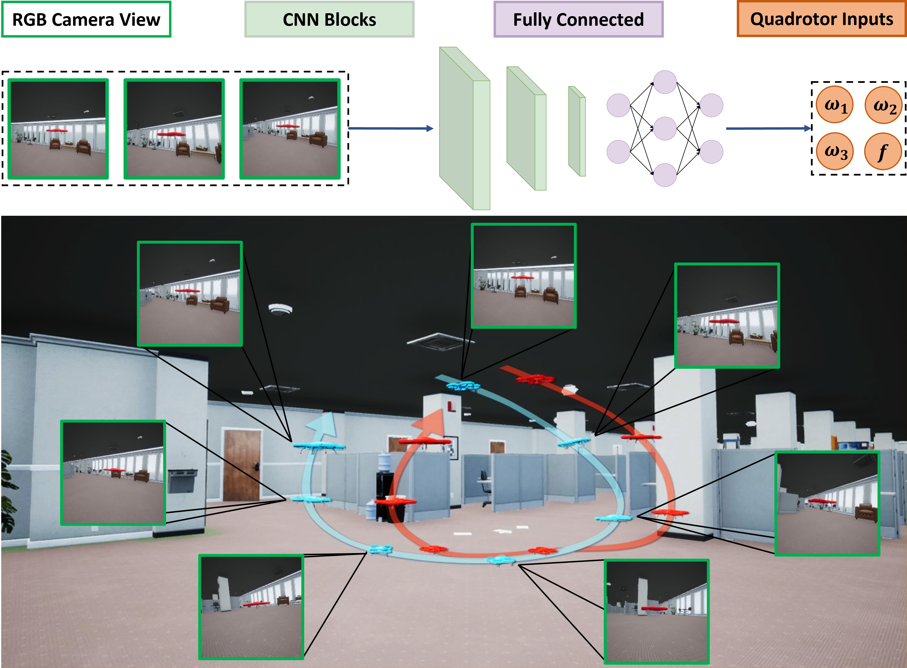
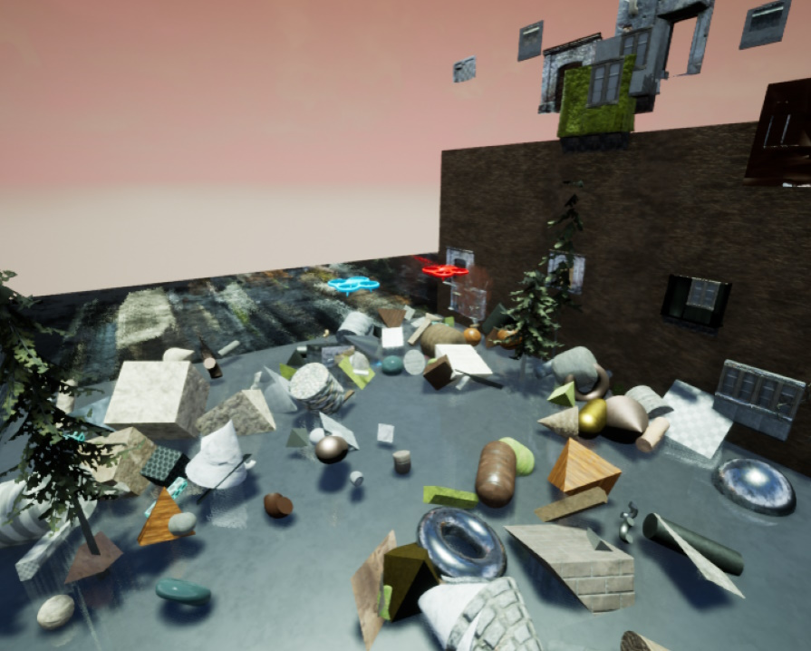
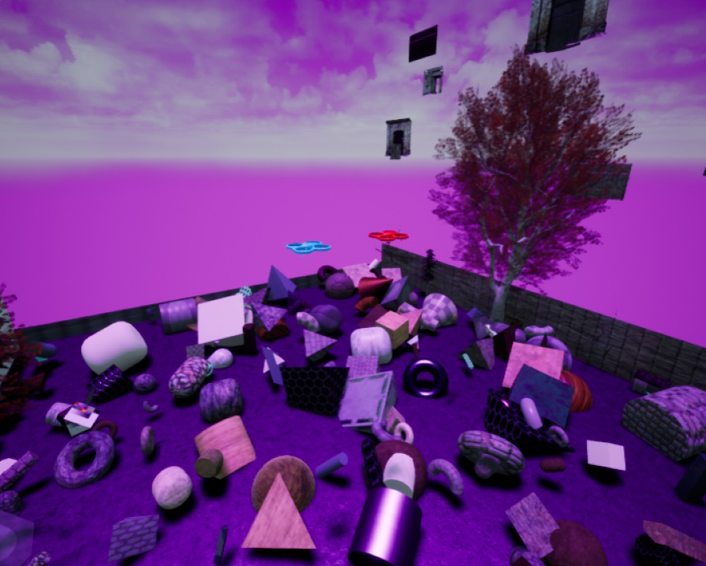
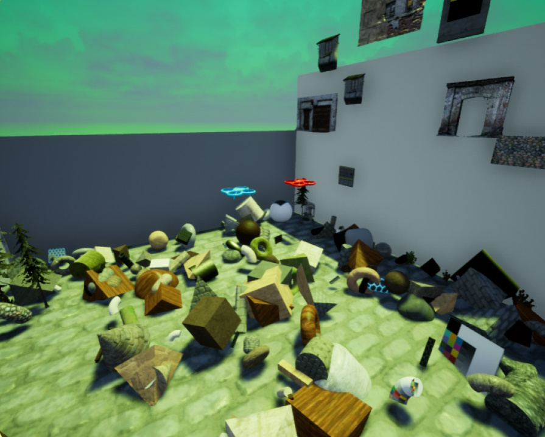
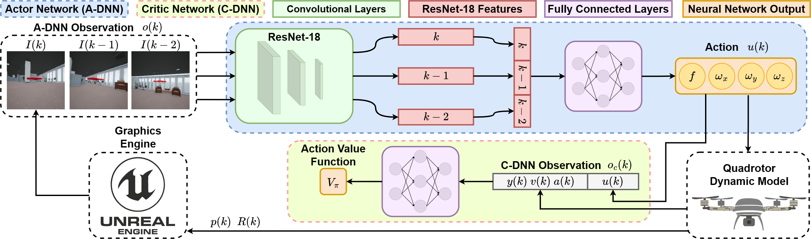

# D-VAT: End-to-End Visual Active Tracking for Micro Aerial Vehicles

This repository is the official implementation of [D-VAT: End-to-End Visual Active Tracking for Micro Aerial Vehicles](). 

---

## Abstract

<div style="text-align:justify"> 
Visual active tracking is a growing research topic in robotics due to its key 
role in applications such as human assistance, disaster recovery, and surveillance. 
In contrast to passive tracking, active tracking approaches combine vision and 
control capabilities to detect and actively track the target. Most of the work 
in this area focuses on ground robots, while the very few contributions on aerial
platforms still pose important design constraints that limit their applicability. 
To overcome these limitations, in this paper we propose D-VAT, a novel end-to-end
visual active tracking methodology based on deep reinforcement learning that is 
tailored to micro aerial vehicle platforms. The D-VAT agent computes the vehicle 
thrust and angular velocity commands needed to track the target by directly 
processing monocular camera measurements. We show that the proposed approach 
allows for precise and collision-free tracking operations, outperforming different
state-of-the-art baselines on simulated environments which differ significantly 
from those encountered during training. Moreover, we  demonstrate a 
smooth real-world transition to a quadrotor platform with mixed-reality.
</div>

<p></p>


<figure>
  <figcaption text-align="justify"><b>Overview of the VAT task. The tracker MAV (blue) adjusts its position and orientation so as to keep the target MAV (red) at the center of the camera FoV and at a predefined distance. Our approach exploits an end-to-end DRL-based VAT method that directly maps RGB images into thrust and angular velocity commands that are fed to the tracker.</b></figcaption>
  
</figure>

---

## Configuration

### Python

The code has been tested with Python 3.8 in a Windows host machine. You can install the requirements with:

```
pip install torch==1.11.0+cu113 torchvision==0.12.0+cu113 torchaudio==0.11.0 --extra-index-url https://download.pytorch.org/whl/cu113
pip install stable-baselines3==1.5.0
pip install opencv-python==4.5.5.64
pip install scipy==1.8.0
pip install wandb
```

**NB**: pytorch must be installed depending on your pc configuration (CPU or GPU).

### Unreal Engine 4

We used Unreal Editor 4.26.2 to build the training environment. We compiled a packaged version
of the Box Environments that can be downloaded from this [link](https://unipg-my.sharepoint.com/:u:/g/personal/alberto_dionigi_studenti_unipg_it/EUAkz-Swq8NFnETrQevvPnEBnh4t2wfqxlUaTX0T8yFxdQ?e=83zbiC).

<div class="immagini">
  
   
  
</div>

Once downloaded the file, unzip in on your computer and run VAT.exe. Install the Unreal Engine
runtime and, after installation, a black window should open. At start time the window is black 
to optimize the training, however, if you want to see the environment and enable rendering,
you have to set True the `render` flag in the next steps.

**NB**: When you launch the training and Windows try to connect to the UE4 program for the first time,
the Unreal Engine process could crash with a Fatal Error. It is a known issue, just launch again VAT.exe
and start the training again, it will not crash a second time.


---

## Usage



Inside `run_code.py` there is a list of parameters that can be configured:
```
'num_cpu': 6,
'n_timesteps': 10000,
'batch_size': 64,
'buffer_size': 10000,
'train_freq': 8,
'WandB': False,
'WandB_project': '<your_wandb_project>',
'WandB_entity': '<your_wandb_entity>',
'WandB_API_key': '<your_wandb_api_key>',
'render': False,
'eval_episodes': 5,
'eval_mode': False,
'ts': 0.05,
'observation_buffer_length': 3
```
where:
- **num_cpu** is the number of parallel training environments (Suggested: PC cores number - 2).
- **n_timesteps** Timesteps of training before a validation test.
- **batch_size** **buffer_size** **train_freq** Training configuration parameters
- **WandB** boolean if you want to use Wandb to monitor the training.
- **WandB_project - WandB_entity - WandB_API_key** Wandb configuration parameters.
- **render** enable rendering of Unreal Engine 4. (Use only for test)
- **eval_episodes** number of episodes for the validation phase.
- **eval_mode** enables evaluation mode (Leave it false if you want to start a new training).
- **ts** Time step of the RL training and the dynamic model.
- **observation_buffer_length** length of the Actor observation buffer.

### Training

Once configured the hyperparameters, just run `run_code.py` with `'eval_mode': False` to start the training.

### Evaluation
During training, the script save the best models in the experiments folder. To test one model
just configure correctly:
```
model = SAC.load(os.path.join("experiments/SAC_{}".format(<experiment_numer>), "SAC_{}".format(<model_numer>)), env=eval_env)
```
where **experiment_numer** and **model_numer** have to match the name of the folder and the file of
the model you want to test.

Once everything is configured, just run `run_code.py` with `'eval_mode': True` to start the evaluation phase. 
If you want also to disable the black screen in Unreal, remember to set `'render': True`.


### PreTrained Models

You can download one of our pre-trained models from [here](https://unipg-my.sharepoint.com/:u:/g/personal/alberto_dionigi_studenti_unipg_it/EdbasJ4SptZFtldkpuP744IB6_ZbOOpxinleJ5gF91mZGw?e=u2Jr37). Just unzip it in the experiments folder and accordingly configure 
**experiment_numer** and **model_numer** of the previous step correctly. 

Inside `run_code.py` there is
Once configured the hyperparameters, just run `run_code.py` with `'eval_mode': False` to start the training.

---

## Citing

If you use this code in a scientific context, please cite the following:

> 

BibTeX details:

```bibtex

```
